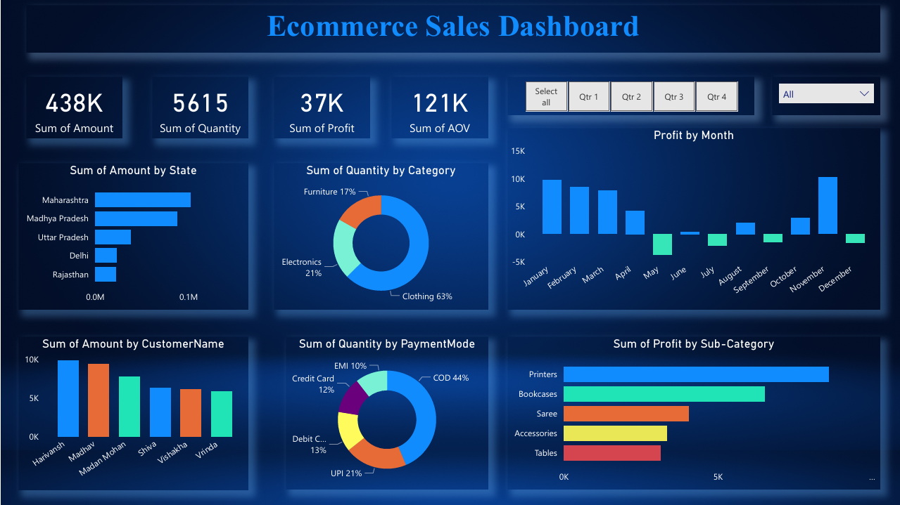

# 📊 E-Commerce Sales Dashboard

An interactive Power BI dashboard that visualizes product, category, and region-wise sales with dynamic KPIs and filters to drive actionable insights.

---

## 🚀 Overview

This project delivers a professional sales analytics dashboard that helps businesses:
- Track product/category/regional performance
- Monitor key performance indicators (KPIs)
- Identify top-selling products and customers
- Analyze trends using time filters and slicers

---

## 🧠 Tools & Technologies

- **Power BI** – Main dashboard creation
- **DAX** – For calculated columns, measures, and dynamic KPIs
- **Excel/CSV** – Raw data preparation
- **Power Query** – Data cleaning and transformation

---

## 📷 Dashboard Screenshots

### 🖥️ Main Dashboard Overview

Displays KPIs, sales trends, and top-performing categories by region.

---

## 📌 Key Features

- 📈 Dynamic KPIs (Total Sales, Profit, Orders)
- 🌍 Region & Category Drilldowns
- 🧠 DAX-powered insights (YOY Growth, Top 5 Products)
- 🕒 Time-based filtering (Year, Quarter, Month)
- 📤 Easy data refresh for new inputs

---

## ✅ Use Cases

- Business intelligence for e-commerce teams
- Executive reporting dashboards
- Sales & marketing strategy development

---

## 🔧 Getting Started

1. Open `dashboard.pbix` in Power BI Desktop
2. Update the data source path if needed (CSV/Excel)
3. Click “Refresh” to load updated visualizations

---

